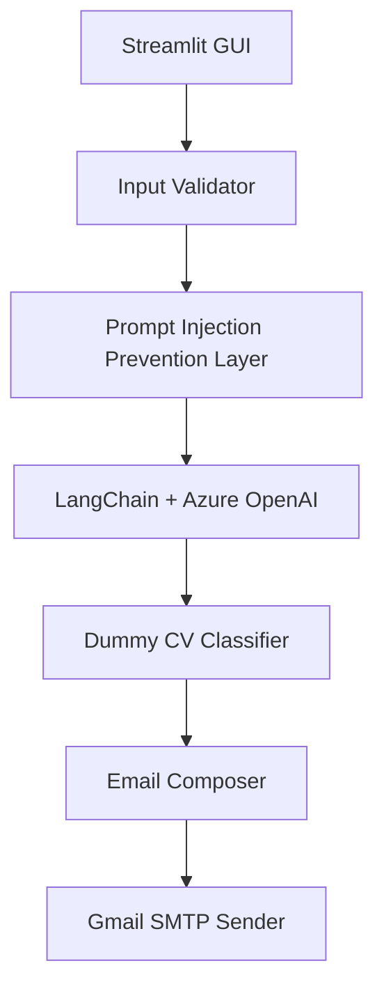

# 🚗 Car Listing Assistant
This project is a modular AI-powered app that helps users list cars for sale by uploading an image and a description. It extracts structured data using LangChain + Azure OpenAI, simulates car type detection, and sends the results via email.

### 📦 Features
- 🖼️ Upload car image via Streamlit GUI

- 📝 Input free-text car description

- 🤖 Extract structured JSON using GPT-4o mini (LangChain + Azure OpenAI)

- 🧪 Simulate car type detection via dummy image classifier

- 📧 Send JSON + image to designated Gmail address

- 🔐 Prevent prompt injection with basic input sanitization

- 🧰 Modular design for future CV model integration

### 🧠 Architecture Overview


### ⚙️ Setup Instructions
1. Clone the repo
``` 
git clone https://github.com/hassanmohamed552/car-listing-help.git
cd car-listing-assistant
``` 
2. Create a .env file
```
AZURE_OPENAI_API_KEY=your_azure_openai_key
AZURE_OPENAI_ENDPOINT=https://orionopenai-techtest.openai.azure.com/
OPENAI_API_VERSION=2025-01-01-preview
SMTP_EMAIL=your_email@gmail.com
SMTP_PASSWORD=your_app_password
```
🔐 Use Gmail App Password if 2FA is enabled

3. Install dependencies
```
pip install -r requirements.txt
```
4. Run the app
```
python -m streamlit run app.py
```
### 📤 Sample Output
```
{
  "car": {
    "body_type": "sedan",
    "color": "Blue",
    "brand": "Ford",
    "model": "Fusion",
    "manufactured_year": 2015,
    "motor_size_cc": 2000,
    "tires": {
      "type": "brand-new",
      "manufactured_year": 2022
    },
    "windows": "tinted",
    "notices": [
      {
        "type": "collision",
        "description": "The rear bumper has been replaced after a minor collision."
      }
    ],
    "price": {
      "amount": 1000000,
      "currency": "L.E"
    }
  }
}
```
### Solution Creation Prompt:
we want to create a simple GUI to Enable users to upload a car image and input a text description using
streamlit library and Use the GPT-4o mini model (via LangChain/LangGraph) to convert the input text into a structured JSON format ,
Implement some simple measures to prevent the user from misusing the tool ,and send the car image and json file to a gmail address
and Create a dummy function for image classification to simulate car type detection, enabling future integration with the real CV model
